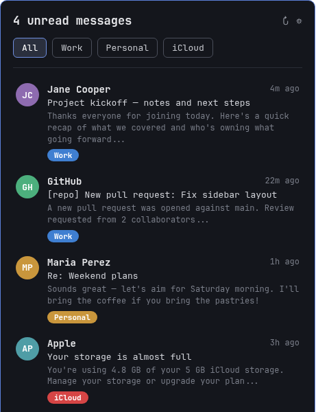

# OmaIMAPMail

A multi-account IMAP unread-mail plugin for the [Omarchy](https://omarchy.org/)
shell bar. One icon, any number of accounts — Gmail, iCloud, Fastmail,
Outlook, or any other IMAP provider — each with its own color, its own
desktop notifications, and its own entry in a built-in settings form. No
config file editing, no separate plugin per account.


*(illustrative mockup with placeholder mail — not a real inbox)*

> Fork notice: OmaIMAPMail started as a fork of
> [keithnyc/omafmail](https://github.com/keithnyc/omafmail) (MIT licensed),
> which pioneered the read-only IMAP IDLE watcher and notification design
> this plugin still builds on. It has since been substantially rewritten
> into a multi-account plugin with an in-shell settings UI — see
> [`CHANGELOG.md`](CHANGELOG.md) for the full list of what changed and why,
> and [`LICENSE`](LICENSE) for attribution.

## Features

- **Any number of IMAP accounts, one bar icon.** Combined unread count in
  the bar; the popup lists every account's mail together.
- **Add, edit, or remove accounts from the shell itself.** Click the gear
  icon in the popup — no config files, no new plugin folders, no
  `omarchy plugin enable`.
- **Per-account color coding.** Pick a color when you add an account; every
  message row carries a colored badge for the account it came from.
- **Filter by account.** Buttons above the message list narrow the view to
  one account or show everything combined.
- **Desktop notifications, per account, only for genuinely new mail.** No
  notification flood on first install or reconnect — each account tracks
  its own "already seen" baseline.
- **Passwords never touch a config file.** App passwords go straight into
  your system keyring via `secret-tool`, written over a pipe, never to
  argv, disk, or a log line.
- **Read-only, always.** Every IMAP session is `SELECT ... READONLY` with
  `BODY.PEEK[]` fetches — this plugin cannot mark your mail as read or
  modify it in any way, on any account.
- **Click a message** to open that account's webmail inbox in your browser.
  **Right-click the bar icon** (or use the popup's refresh button) to
  reconnect every account immediately.

## Requirements

- [Omarchy](https://omarchy.org/) with a shell that supports third-party
  `service` + `bar-widget` plugins
- Python 3, standard library only — no `pip install` needed
- `secret-tool` (part of `libsecret`) and a running Secret Service provider
  (GNOME Keyring is already active on most Omarchy installs)
- `omarchy-notification-send` (ships with Omarchy)

## Install

```bash
omarchy plugin add https://github.com/eddownes/omaimapmail.git --enable
```

This clones the plugin into `~/.config/omarchy/plugins/io.github.eddownes.omaimapmail`
and enables its bar icon. If you'd rather do it in two steps:

```bash
omarchy plugin add https://github.com/eddownes/omaimapmail.git
omarchy plugin enable io.github.eddownes.omaimapmail right
```

### Install for local development

```bash
git clone https://github.com/eddownes/omaimapmail.git
ln -s "$PWD/omaimapmail" ~/.config/omarchy/plugins/io.github.eddownes.omaimapmail
omarchy-shell shell rescanPlugins
omarchy plugin enable io.github.eddownes.omaimapmail right
```

## Setup

No config file to create by hand — everything happens in the shell.

1. **Click the mail icon** in the bar to open the popup (it starts empty
   with no accounts configured).
2. **Click the gear icon** (top right of the popup) to open account
   management.
3. **Click "+ Add account"** and fill in:

   | Field | What to enter |
   |---|---|
   | Label | Any name you want shown in the UI, e.g. "Work Gmail" |
   | Account email | Your full email address — also the IMAP username |
   | IMAP host | Your provider's IMAP server (see table below) |
   | Port | `993` for essentially every provider (IMAP over TLS) |
   | Fetch limit | Max unread messages to fetch/display per account (default 20) |
   | Mailbox | Which folder to watch (default `INBOX`) |
   | Webmail URL | Opened when you click a message from this account (optional) |
   | App password | See provider notes below — **not** your regular login password for most providers |
   | Color | Pick a swatch to color-code this account's badge |

4. **Click Save.** The account connects within a few seconds; a red banner
   in the popup tells you immediately if sign-in failed.

### Provider notes

Most providers require an **app-specific password**, not your normal
account password, once two-factor authentication is on (which is standard
almost everywhere now). Using your regular password will fail with an
"Invalid credentials" / "Sign-in failed" error.

| Provider | IMAP host | App password |
|---|---|---|
| **Gmail** | `imap.gmail.com` | Enable 2-Step Verification, then generate one at [myaccount.google.com/apppasswords](https://myaccount.google.com/apppasswords). Also enable IMAP: Gmail Settings → *See all settings* → *Forwarding and POP/IMAP* → Enable IMAP → Save Changes. |
| **iCloud Mail** | `imap.mail.me.com` | Generate at [appleid.apple.com](https://appleid.apple.com) → Sign-In and Security → App-Specific Passwords. |
| **Fastmail** | `imap.fastmail.com` | Settings → Privacy & Security → App passwords → create one with **IMAP** access. |
| **Outlook / Microsoft 365** | `outlook.office365.com` | Requires an app password if Security Defaults / MFA is on — generate from Microsoft account security settings. |
| Other IMAP providers | check your provider | Look for "app password" or "app-specific password" in their account security settings. |

Storing the password: when you type it into the Add/Edit form and click
Save, OmaIMAPMail runs `secret-tool store` for you — you never need to run
it yourself. (If you ever want to store or update one manually instead:
`secret-tool store --label="OmaIMAPMail: you@example.com" service omaimapmail-<account-id> account you@example.com`,
where `<account-id>` is the slug shown for that account — see
[Configuration](#configuration) below.)

## Usage

- **Left-click** the bar icon to open/close the popup.
- **Right-click** the bar icon to reconnect every account immediately (same
  as the refresh button inside the popup).
- Use the **All / [Account name]** buttons at the top of the popup to
  filter the message list.
- **Click a message row** to open that account's webmail (if a webmail URL
  was set for it).
- **Gear icon** → manage accounts: pencil to edit (leave the password field
  blank to keep the existing one), trash to remove (asks for confirmation
  first).

## Configuration

Everything lives in two places:

```
~/.config/omaimapmail/accounts.json          # account list (no secrets)
~/.local/state/omaimapmail/<account-id>/state.json   # per-account "seen mail" baseline
```

`accounts.json` is a JSON object with an `accounts` array; each entry:

```json
{
  "id": "work-gmail",
  "label": "Work Gmail",
  "color": "#3f7fd1",
  "host": "imap.gmail.com",
  "port": 993,
  "account": "you@gmail.com",
  "mailbox": "INBOX",
  "secretService": "omaimapmail-work-gmail",
  "fetchLimit": 20,
  "inboxUrl": "https://mail.google.com/mail/u/0/",
  "enabled": true
}
```

You can hand-edit this file if you prefer — OmaIMAPMail watches it and
reconnects automatically on save. `id` should be a short, unique, URL-safe
slug (the settings UI generates one from the label automatically). Setting
`"enabled": false` on an entry disables that account without deleting it.
`secretService` is the `service` attribute `secret-tool` uses to look up
that account's password — it must match whatever you used with
`secret-tool store`.

Passwords are never stored in this file — only in your system keyring.

## Uninstall

```bash
omarchy plugin remove io.github.eddownes.omaimapmail
```

This removes the plugin code and disables the bar icon, but leaves your
configuration, keyring entries, and local state intact so re-enabling later
picks up right where you left off. To remove everything:

```bash
rm -rf ~/.config/omaimapmail ~/.local/state/omaimapmail
```

and clear each account's keyring entry:

```bash
secret-tool clear service omaimapmail-<account-id> account you@example.com
```

## Privacy & security

- OmaIMAPMail connects to your IMAP server(s) directly from your machine —
  no relay, no third-party service in between.
- `accounts.json` never contains a password.
- App passwords live only in your system keyring; they're written to the
  password-store process over a pipe and never appear in argv, a file, or
  a log line.
- Every IMAP session is opened read-only (`SELECT ... READONLY`) and every
  fetch uses `BODY.PEEK[]` — this plugin cannot mark mail as read, delete
  it, or otherwise modify your mailbox, on any account, ever.
- Plugins run unsandboxed inside `omarchy-shell`, with your full user
  permissions, same as any other Omarchy plugin. Read the source (it's not
  large) before you enable it, same as you should for anything else that
  runs with your credentials.

## Limitations

- "Click a message" opens the account's general inbox view, not a deep
  link to that exact message — IMAP UIDs don't map to most webmail
  providers' internal message IDs.
- The preview is the plain-text part of the message; HTML-only mail
  without a plain-text alternative may show a rough or empty snippet.
- Editing `accounts.json` (by hand or through the settings form) restarts
  the watcher process for **every** account, not just the one that
  changed — expect a brief (~1-2 second) reconnect blip across all
  accounts whenever you add, edit, or remove one.

## Contributing / issues

Issues and pull requests welcome at
[github.com/eddownes/omaimapmail](https://github.com/eddownes/omaimapmail).

## License

MIT — see [`LICENSE`](LICENSE). Originally forked from
[keithnyc/omafmail](https://github.com/keithnyc/omafmail) (MIT licensed);
see [`CHANGELOG.md`](CHANGELOG.md) for what's changed since.
